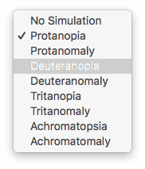
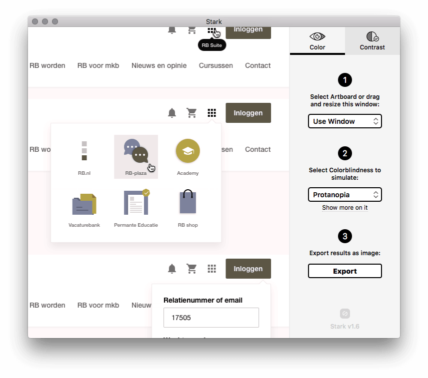

Voor het versnellen van je workflow in [Sketch](https://sketchapp.com/), de digitale ontwerptool voor designers, zijn de volgende plugins interessant.

## Sketch Runner

Met de plugin Sketch Runner kan je snel rond Sketch navigeren en acties uitvoeren die je tijd besparen. Met een zoekinterface voer je commando’s uit zonder dat je een muis hoeft te gebruiken.

Met de combinatie `CMD` + `'` en tab voer je acties uit zoals run, goto, insert, create, apply en install. Plugins kan je ook vanuit daar beheren.

[Download Sketch Runner](http://sketchrunner.com/)

## Sketch Relabel Button

De plugin Sketch Relabel Button doet wat de naam al aangeeft. Met de toetsencombinatie `CMD` + `J` pas je gemakkelijk het label van een button aan. Na bewerking is bijvoorbeeld de padding van je button automatisch aangepast. Bespaart bij meerdere iteraties een hoop tijd!

<video controls playsinline src="/sketch-measure-plugin-voorbeeld.mp4"></video>

[Download Sketch Relabel Button](https://github.com/kenmoore/sketch-relabel-button)

## Sketch Measure

Om een design te vertalen naar het ontwikkelteam is het nodig om afmetingen en meer duidelijk te maken. Mocht je niet gebruik kunnen maken van tools zoals bijvoorbeeld [Gallery](https://material.io/tools/gallery/) van Google, die dit automatisch voor je doet, dan is Sketch Measure een goede optie. Via het plugin menu kan je verschillende richtlijnen maken waarbij jij en anderen specificaties kunnen aflezen.

<video controls playsinline src="/sketch-measure-plugin-voorbeeld.mp4"></video>

[Download Sketch Measure](http://utom.design/measure/)

## Stark

Klaar met een ontwerp? Hoe ziet je ontwerp er voor kleurenblinden uit? Sketch heeft hiervoor ook een plugin, genaamd Stark. Met deze tool kan je visueel meerdere soorten kleurenblindheid testen.

[Download Stark](http://getstark.co/)

## Craft

Craft bevat meerdere handige tools van [InVision](https://www.invisionapp.com/craft) in één plugin. Zo is het mogelijk om delen van je design te dupliceren/beheren. Ook kan je willekeurige foto’s en verschillende soorten teksten genereren.

<video controls playsinline src="/sketch-craft-plugin-voorbeeld.mp4"></video>

[Download Craft](https://www.invisionapp.com/craft)

Ken jij nog een plugin die niet in dit lijstje staat maar zeker niet mag ontbreken? Laat wat van je horen.