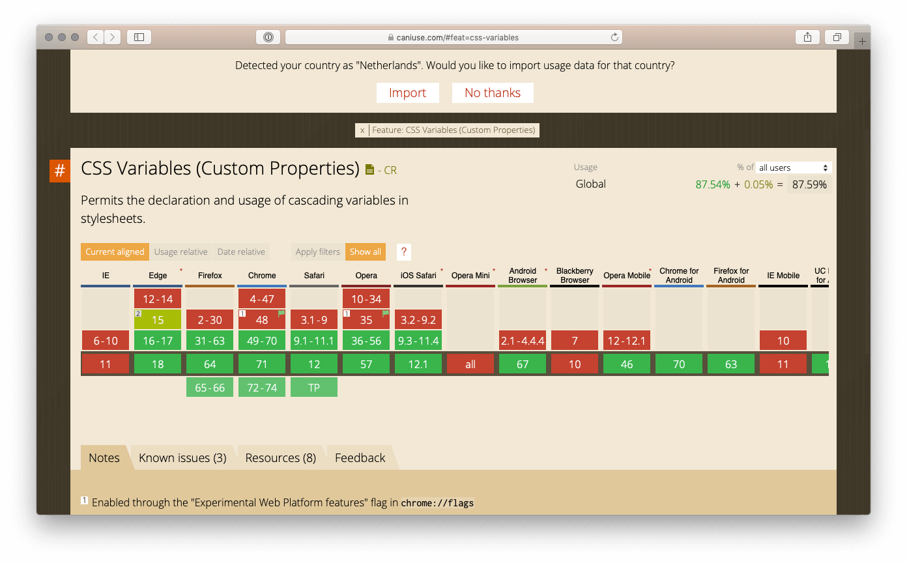

In CSS zijn variabelen er voornamelijk om consistent hergebruikt te worden. Nu zijn variabelen al lang onderdeel van [verschillende preprocessors](https://developer.mozilla.org/en-US/docs/Glossary/CSS_preprocessor). Native heeft CSS ook [CSS custom properties](https://developer.mozilla.org/en-US/docs/Web/CSS/Using_CSS_variables) (hierna CSS variabelen genoemd). Beide hebben zo hun voor- en nadelen afhankelijk van de situatie waarin je ze toepast. Welke dat zijn lees je hier.

> CSS variables are entities defined by CSS authors that contain specific values to be reused throughout a document.
[MDN web docs](https://developer.mozilla.org/en-US/docs/Web/CSS/Using_CSS_variables)

## Preprocessor variabelen

In het voorbeeld hieronder gebruik ik preprocessor [Sass](http://sass-lang.com/) (Syntactically Awesome StyleSheets) variabelen in SCSS syntax.

```scss
$body-bg: #FAFAFA;
$black: #000000;

body {
  background-color: $body-bg;
  color: $black;
}
```

Nadat de preprocessor SCSS heeft omgezet naar CSS krijg je het volgende als resultaat. Simpel en basic.

```css
body {
  background-color: #FAFAFA;
  color: #000000;
}
```

Hetzelfde resultaat behaal je ook met CSS variabelen.

## CSS variabelen

```css
:root {
  --body-bg: #FAFAFA;
  --black: #000000;
}

body {
  background-color: var(--body-bg);
  color: var(--black);
}
```

Dit doet precies hetzelfde als het eerder gegeven Sass voorbeeld.

## Voor- en nadelen

Er zijn wel situaties te bedenken waar het gebruik van de ene een voordeel kan hebben ten opzichte van de ander.

### Preprocessor variabelen

Het grootste voordeel ten opzichte van CSS variabelen is dat een preprocessor geen last heeft van falende browser compatibiliteit.

Op het moment van schrijven laat een check op [caniuse.com](https://caniuse.com/#feat=css-variables) zien dat de ondersteuning voor CSS variabelen redelijk goed is. Een aantal browsers valt zoals verwacht wel buiten de boot. Gebruikt jou doelgroep voornamelijk browsers zoals IE 11 of meer oude meuk 😂 dan kan je niet anders dan alleen preprocessor variabelen gebruiken.



Browser support voor CSS variabelen (CSS Custom Properties) is redelijk goed, namelijk 87,54% wereldwijd (rechtsboven zichtbaar)

### CSS variabelen

Het eerste voordeel is dat je geen preprocessor nodig hebt. Alleen een browser die het ondersteunt en je kan aan de slag.

Het voordeel van CSS variabelen is dat je de variabelen kan beïnvloeden tijdens je gebruik/bezoek van een website in je browser. Dit kan op style niveau. Denk bijvoorbeeld aan breakpoints met media queries.

Ook met javascript kan je CSS variabelen aanpassen. In het volgende voorbeeld kan je door simpel de CSS variabel op de :root aan te passen kleur wijzigingen doen door heel je site. Als het ware worden de CSS variabelen gewoon bijgewerkt. In het voorbeeld hieronder nemen de `h1` en `.tile` gewoon de kleur van variabele `var(--black)` uit de :root over.

<iframe height='265' scrolling='no' title='CSS Custom Properties test' src='//codepen.io/royvn/embed/rovMyM/?height=265&#038;theme-id=0&#038;default-tab=js,result' frameborder='no' allowtransparency='true' allowfullscreen='true' style='width: 100%;'>See the Pen <a href='https://codepen.io/royvn/pen/rovMyM/'>CSS Custom Properties test</a> by Roy (<a href='https://codepen.io/royvn'>@royvn</a>) on <a href='https://codepen.io'>CodePen</a>.
</iframe>

## Tot slot

CSS variabelen zijn ongetwijfeld een goede toevoeging. Afhankelijk van je doelgroep en eigen wensen kan je een afweging maken welke soort variabelen te gebruiken. Geen van beide is goed of slecht. Het is wel leuk om te zien hoe CSS variabelen default steeds beter ondersteund worden door browsers.

---

## Links

* Mozilla, (2018, 22 december). Using CSS custom properties (variables). Geraadpleegd op 20 januari 2019, van [https://developer.mozilla.org/en-US/docs/Web/CSS/Using_CSS_variables](https://developer.mozilla.org/en-US/docs/Web/CSS/Using_CSS_variables)
* Sass, (2006 – 2018). Sass: Sass Basics. Geraadpleegd op 20 januari 2019, van http://sass-lang.com/guide