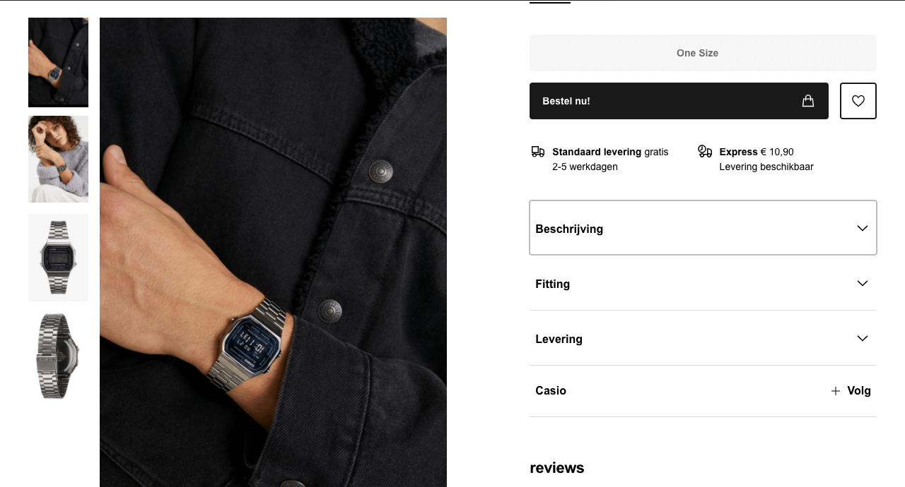
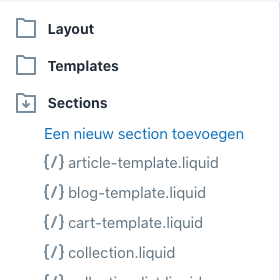
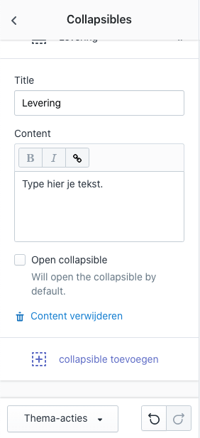

Een informatieve productbeschrijving is één van de meerdere [must haves](https://www.nngroup.com/articles/ecommerce-product-pages/) bij een ecommerce productpagina. Het beknopt houden kan nog best een uitdaging zijn als je veel informatie kwijt moet. Mocht je producten hebben waarbij dit het geval is kan het de oplossing zijn om informatie op te splitsen in kleinere in- en uitklapbare blokken. Hoe je dat doet lees je in deze tutorial waarbij we stap voor stap een [Shopify section](https://shopify.dev/tutorials/develop-theme-use-sections) maken die je in je Shopify store kan gebruiken.

## TL;DR

Als je niet de tutorial wilt volgen, maar wel de Shopify section wilt toevoegen aan je store, klik dan [hier om direct naar de eind implementatie te gaan](#implementatie). 

## Wat we gaan maken

Voordat we beginnen kijken we eerst naar een andere grote webshop ter referentie. Dit zodat je een beter beeld krijgt van wat we gaan maken. Een goed voorbeeld is de productpagina van [Zalando](https://www.zalando.nl/heren-home/).



De productinformatie staat daar zoals wij ook willen in meerdere blokken die je in en uit kan klappen.

Gekeken naar wat we willen bereiken in Shopify moeten we drie verschillende type blokken maken, namelijk:

* blok met product Shopify data
* blok met product specifieke data die niet in Shopify bestaat
* blok(ken) data die bij ieder product terug moeten komen

Met **product Shopify data** bedoel ik de normale velden en gegevens die we uit de Shopify kunnen ophalen. Hiervoor gebruiken we het [product object](https://shopify.dev/docs/themes/liquid/reference/objects/product) in [liquid](https://shopify.dev/docs/themes/liquid/reference). Het enige wat we hieruit zullen halen is `product.description`.

Vervolgens creeëren we de nog niet bestaande **product specifieke data** met [metafields](https://help.shopify.com/en/manual/products/metafields). Hiermee kunnen we extra gegevens opslaan per product.

Als laatste hebben we nog blokk(en) die bij **elk product terug mogen komen** en dus hetzelfde zijn. Hiervoor gebruiken we de section blocks zelf.

## Section

Nu we een beter beeld hebben van wat we gaan maken kunnen we aan de slag met onze eigen [Shopify section](https://shopify.dev/tutorials/develop-theme-use-sections).

De eerste stap voor het maken van een section is het aanmaken van een bestand. Maak een nieuwe section aan met de naam **product-collapsibles.liquid** of een naam naar keuze. 

Het maken van een nieuwe section kan via de Shopify online editor of als je developer bent via je [favoriete code editor](https://code.visualstudio.com/) 😄.



Een section bestaat uit [liquid](https://www.shopify.com/partners/shopify-cheat-sheet), [javascript, sass](https://shopify.dev/tutorials/develop-theme-use-sections#javascript-and-stylesheet-tags) en een [schema json](https://shopify.dev/tutorials/develop-theme-use-sections#using-section-schema-tags) configuratie.

We starten met de schema json configuratie zodat we content kunnen opvoeren en uitlezen in liquid.

```json

{
  "name": "Collapsibles",
  "settings": [
    {
      "type": "header",
      "content": "Product",
      "info": "Configure the product description."
    },
    {
      "type": "checkbox",
      "id": "description",
      "label": "Show",
      "info": "Add to product description to the collapsibles.",
      "default": true
    }, 
    {
      "type": "checkbox",
      "id": "is_collapsible_open",
      "label": "Open collapsible",
      "info": "Will open the collapsible by default.",
      "default": true
    },
    {
      "type": "header",
      "content": "Metafields",
      "info": "Use metafields to create product specific collapsibles. The 'namespace' must be 'collapsibles'. The 'key' is used as title. 'Value' as content."
    }
  ],
  "blocks": [
    {
      "type": "collapsible",
      "name": "Collapsible",
      "settings": [
        {
          "type": "text",
          "id": "title",
          "label": "Title"
        }, 
        {
          "type": "richtext",
          "id": "content",
          "label": "Content"
        },
        {
          "type": "checkbox",
          "id": "is_collapsible_open",
          "label": "Open collapsible",
          "info": "Will open the collapsible by default.",
          "default": false
        }
      ]
    }
  ]
}

```

Het [blocks](https://shopify.dev/tutorials/develop-theme-use-sections#rendering-section-blocks) gedeelte in de json zorgt ervoor dat er in de section onder content meerdere blokken toegevoegd kunnen worden.

Uiteindelijk heeft onze configuratie het volgende resultaat in de Shopify theme editor.



Nu we de section voorbereid hebben kunnen we aan de slag met het liquid gedeelte om de html en data output te maken. Al je liquid plaats je boven de json configuratie.

### Shopify data
De product description is default in Shopify en valt onder het product object. In samenwerking met de gemaakte instellingen schrijven we de volgende liquid.

```html

  
    <li class="product-collapsible  product-collapsible--closed">
      <button type="button" class="product-collapsible__toggle" data-toggle-product-collapsible>
        <span>
          {{ 'product.description' | t }}
        </span>
        <span class="icon"></span>
      </button>
      <div class="product-collapsible__content product-collapsible__content">
        <div class="rte">
          {{- product.description -}}
        </div>
      </div>
    </li>
  

```

### Metafields
Eigen velden met waardes zijn niet default beschikbaar in Shopify. Er zijn metafields maar die kan je alleen met een [metafields app](https://apps.shopify.com/metafields-editor-2) beheren. Installeer dan ook een app naar wens.

We schrijven de volgende logica om alle gegevens uit de metafields te kunnen halen.

Als je een metafield maakt gebruik je het format, namespace: collapsible, key: titel, value: De inhoud van je in en uitklapbare blok. Dat is alles!

```html

  
  
    
      
      
      <li class="product-collapsible product-collapsible--closed">
        <button type="button" class="product-collapsible__toggle" data-toggle-product-collapsible>
          <span>
            {{- key | capitalize -}}
          </span>
          <span class="icon"></span>
        </button>
        <div class="product-collapsible__content">
          <div class="rte">
            <p>
              {{- value -}}
            </p>
          </div>
        </div>
      </li>
    
  
  

```

### Blocks 
Voor het toevoegen van globale informatie, die bij ieder product terug moet komen, gebruiken we de gebouwde blocks van de section. Deze blokken kan je toevoegen in de theme editor onder customizer.

```html

  
    
      
        <li class="product-collapsible product-collapsible--closed">
          <button type="button" class="product-collapsible__toggle" data-toggle-product-collapsible>
            <span>
              {{- block.settings.title -}}
            </span>
            <span class="icon"></span>
          </button>
          <div class="product-collapsible__content">
            <div class="rte">
              {{- block.settings.content -}}
            </div>
          </div>
        </li>
      
    
  

```

## Output section
Nu we de product beschrijving, metafields en *blocks* hebben uitgelezen willen we die, indien ze gevuld zijn, weergeven. Dit doen we met het volgende stuk. Als er geen content is laten we ook niks zien.

```html

  <ul class="product-collapsibles">
    {{- collapsible_description -}}
    {{- collapsible_metafields -}}
    {{- collapsible_blocks -}}
  </ul>

```

## Javascript

```js

  function handleCollapsible() {
    document.addEventListener('click', function(event){
      if('toggleProductCollapsible' in event.target.dataset) {
        event.target.parentElement.classList.toggle('product-collapsible--closed');
      }
    });
  }
  handleCollapsible();
  document.addEventListener('shopify:section:load', function(){
    handleCollapsible();
  });

```

## Styling
Vervolgens voegen we nog [scss](https://sass-lang.com/) styling toe.
```scss
.product-collapsible {
  border-top: 1px solid rgba(0, 0, 0, 0.16);
  &.product-collapsible--closed {
    .product-collapsible__toggle {
      span.icon {
        transform: translateY(-50%) rotate(90deg);
        &:after {
          transform: translateX(-50%) translateY(-50%) rotate(90deg);
        }
      }
    }
    .product-collapsible__content {
      max-height: 0;
    }
  }
  .product-collapsible__toggle {
    appearance: none;
    border: none;
    margin: 0;
    cursor: pointer;
    position: relative;
    display: block;
    text-align: left;
    width: 100%;
    font-size: 1rem;
    line-height: 1.5rem;
    font-weight: bold;
    padding: 0.75rem 2rem 0.75rem 0;
    background-color: transparent;
    &:hover, 
    &:focus, 
    &:active {
      outline: none;
    }
    span.icon {
      position: absolute;
      right: 0;
      top: 50%;
      width: 1.5rem;
      height: 1.5rem;
      transform: translateY(-50%) rotate(0deg);
      transition: all .32s ease-in-out;
      transform-origin: center center;
      &:before,
      &:after {
        content: '';
        display: block;
        background-color: #000000;
        height: 0.125rem; 
        width: 1rem;
        position: absolute;
        top: 50%;
        left: 50%;
        transform: translateX(-50%) translateY(-50%);
        transition: all .32s ease-in-out;
      }
      &:after {
        transform: translateX(-50%) translateY(-50%);
      }
    }
  }
  .product-collapsible__content {
    max-height: auto;
    overflow: hidden;
    transition: all .32s ease-in-out;
    > div {
      padding-bottom: 1rem;
    }
  }
}
```

<h2 id="implementatie">TL;DR implementatie</h2>

1. Ga naar je Shopify theme
2. Klik bij je theme op edit code
3. Maak een nieuwe section product-collapsibles.liquid aan
4. Kopieer de volgende code in je zojuist aangemaakte product-collapsibles.liquid.

```html

  
    <li class="product-collapsible  product-collapsible--closed">
      <button type="button" class="product-collapsible__toggle" data-toggle-product-collapsible>
        <span>
          {{ 'product.description' | t }}
        </span>
        <span class="icon"></span>
      </button>
      <div class="product-collapsible__content product-collapsible__content">
        <div class="rte">
          {{- product.description -}}
        </div>
      </div>
    </li>
  



  
  
    
      
      
      <li class="product-collapsible product-collapsible--closed">
        <button type="button" class="product-collapsible__toggle" data-toggle-product-collapsible>
          <span>
            {{- key | capitalize -}}
          </span>
          <span class="icon"></span>
        </button>
        <div class="product-collapsible__content">
          <div class="rte">
            <p>
              {{- value -}}
            </p>
          </div>
        </div>
      </li>
    
  
  



  
    
      
        <li class="product-collapsible product-collapsible--closed">
          <button type="button" class="product-collapsible__toggle" data-toggle-product-collapsible>
            <span>
              {{- block.settings.title -}}
            </span>
            <span class="icon"></span>
          </button>
          <div class="product-collapsible__content">
            <div class="rte">
              {{- block.settings.content -}}
            </div>
          </div>
        </li>
      
    
  



  <ul class="product-collapsibles">
    {{- collapsible_description -}}
    {{- collapsible_metafields -}}
    {{- collapsible_blocks -}}
  </ul>



.product-collapsible {
  border-top: 1px solid rgba(0, 0, 0, 0.16);
  &.product-collapsible--closed {
    .product-collapsible__toggle {
      span.icon {
        transform: translateY(-50%) rotate(90deg);
        &:after {
          transform: translateX(-50%) translateY(-50%) rotate(90deg);
        }
      }
    }
    .product-collapsible__content {
      max-height: 0;
    }
  }
  .product-collapsible__toggle {
    appearance: none;
    border: none;
    margin: 0;
    cursor: pointer;
    position: relative;
    display: block;
    text-align: left;
    width: 100%;
    font-size: 1rem;
    line-height: 1.5rem;
    font-weight: bold;
    padding: 0.75rem 2rem 0.75rem 0;
    background-color: transparent;
    &:hover, 
    &:focus, 
    &:active {
      outline: none;
    }
    span.icon {
      position: absolute;
      right: 0;
      top: 50%;
      width: 1.5rem;
      height: 1.5rem;
      transform: translateY(-50%) rotate(0deg);
      transition: all .32s ease-in-out;
      transform-origin: center center;
      &:before,
      &:after {
        content: '';
        display: block;
        background-color: #000000;
        height: 0.125rem; 
        width: 1rem;
        position: absolute;
        top: 50%;
        left: 50%;
        transform: translateX(-50%) translateY(-50%);
        transition: all .32s ease-in-out;
      }
      &:after {
        transform: translateX(-50%) translateY(-50%);
      }
    }
  }
  .product-collapsible__content {
    max-height: auto;
    overflow: hidden;
    transition: all .32s ease-in-out;
    > div {
      padding-bottom: 1rem;
    }
  }
}



  function handleCollapsible() {
    document.addEventListener('click', function(event){
      if('toggleProductCollapsible' in event.target.dataset) {
        event.target.parentElement.classList.toggle('product-collapsible--closed');
      }
    });
  }
  handleCollapsible();
  document.addEventListener('shopify:section:load', function(){
    handleCollapsible();
  });




{
  "name": "Collapsibles",
  "settings": [
    {
      "type": "header",
      "content": "Product",
      "info": "Configure the product description."
    },
    {
      "type": "checkbox",
      "id": "description",
      "label": "Show",
      "info": "Add to product description to the collapsibles.",
      "default": true
    }, 
    {
      "type": "checkbox",
      "id": "is_collapsible_open",
      "label": "Open collapsible",
      "info": "Will open the collapsible by default.",
      "default": true
    },
    {
      "type": "header",
      "content": "Metafields",
      "info": "Use metafields to create product specific collapsibles. The 'namespace' must be 'collapsibles'. The 'key' is used as title. 'Value' as content."
    }
  ],
  "blocks": [
    {
      "type": "collapsible",
      "name": "Collapsible",
      "settings": [
        {
          "type": "text",
          "id": "title",
          "label": "Title"
        }, 
        {
          "type": "richtext",
          "id": "content",
          "label": "Content"
        },
        {
          "type": "checkbox",
          "id": "is_collapsible_open",
          "label": "Open collapsible",
          "info": "Will open the collapsible by default.",
          "default": false
        }
      ]
    }
  ]
}


```

5. Voeg het volgende stukje code in `product.liquid` toe op de plaats waar je de blokken wilt hebben.

```html

```

6. Vul de productbeschrijving, metafields en section blokken toe.

<div class="holder holder--16x9">
  <iframe class="holder__embed" src="https://giphy.com/embed/H4zC1A2FZ0ViA6GcxD"></iframe>
</div>

## Afronden

Zelf kan je natuurlijk nog de stijling verbeteren, have fun!

## Links

* Nielsen Norman Group, (2019, 24 november). UX Guidelines for Ecommerce Product Pages. Geraadpleegd op 2 juli 2020, van https://www.nngroup.com/articles/ecommerce-product-pages/